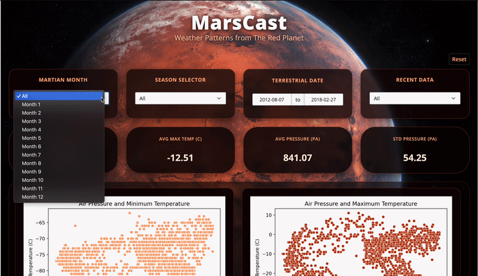

# Mars Weather Dashboard 🪐

Understanding weather conditions on Mars is critical for rover operations, mission planning, and the design of future exploration systems.  
This project builds an interactive dashboard to explore and analyze historical Martian weather data collected by NASA’s *Curiosity Rover*.

## Deployed App

- Stable Dashboard Deployment: https://019c9d15-df54-9f49-50d4-2e3049587ef1.share.connect.posit.cloud/
- Live Development Dashboard: https://019c9156-8ae1-416d-aa21-8c41b68632bf.share.connect.posit.cloud/

---

## Demo



## Overview

This repository contains the code and resources to build a **Mars Weather Dashboard** using modern data visualization tools.  
The key **Scientific and Operational Goals** of this dashboard are:

1. **Monitoring Current Conditions**  
   Track temperature, pressure, wind, and seasonal patterns to approximate present-day Martian weather.

2. **Mission Planning**  
   Identify safer windows in the Martian year for landing and surface operations.

3. **Climate Trends Over Time**  
   Analyze long-term changes and recurring seasonal behavior across multiple sols.

4. **Engineering Constraints**  
   Understand extreme conditions that future rovers must endure, informing design and testing requirements.

---

## Data Description

### The dataset

Weather observations from **Sol 1 (August 7, 2012 on Earth)** to **Sol 1895 (February 27, 2018 on Earth)**, measured directly on the surface of Mars.

### Source & Methodology

- Collected by the **Rover Environmental Monitoring Station (REMS)**  
- On-board the **Curiosity Rover**
- Publicly released by:
  - NASA’s Mars Science Laboratory
  - Centro de Astrobiología (CSIC-INTA)

The REMS instrument records atmospheric and ground-level variables, enabling long-term climate analysis on Mars.

[Find here more information about the dataset.](https://github.com/the-pudding/data/tree/master/mars-weather)

---

## Tools & Technologies

This project uses a combination of Python-based data science and interactive visualization tools:

- **Pandas** – Data wrangling
- **NumPy** – numerical operations and preprocessing
- **Plotly** – interactive, exploratory visualizations
- **Altair** – declarative statistical graphics
- **Shiny (for Python)** – interactive dashboard framework

These tools were chosen to balance **scientific rigor**, **interactivity**, and **clarity for decision-making**.

---

## Dashboard Features

- **Interactive filtering** by Martian month and season to focus analysis on specific periods
- **Recent data view** to inspect the most recent segment of the dataset  
- **Time window control** using terrestrial date range filtering for targeted trend inspection  
- **KPI summary cards** for the filtered subset: average min temperature, average max temperature, average pressure, and pressure standard deviation  
- **Relationship plots** to explore how air pressure relates to daily temperatures (pressure vs min temp; pressure vs max temp)  
- **Time series plots** showing temperature and pressure trends over sols, updating live with filter changes  

---

## Target Audience

This project is intended for:

- Astronauts and mission planners  
- Aerospace engineers  
- Planetary scientists  
- Space data analysts  

The dashboard prioritizes **clarity, interpretability, and operational relevance** over purely academic analysis.

---

## Project Structure

```text
├── README.md
├── description.md
├── environment.yml
├── LICENSE
├── CONTRIBUTING.md
├── CHANGELOG.md
├── CODE_OF_CONDUCT.md
├── team.txt
├── .gitignore
├── data/
│   └── raw/
│       └── mars-weather.csv
├── src/
│   └── app.py
│   └── www/
│       └── mars_bg.png
├── img/
│   └── sketch.png
│   └── data_dictionary.png
│   └── reactivity_diagram.png
│   └── demo.gif
├── notebooks/
|   └── exploratory_data_analysis.ipynb
└── reports/
    └── m1_proposal.md
    └── m2_spec.md
```

## For Contributors

## Getting Started

This project uses a Conda environment to ensure reproducibility across systems and teams.

### Prerequisites

Make sure you have one of the following installed:

- Anaconda or
- Miniconda

Then, follow the next installation steps:

**1. Clone the repository:**

```bash
git clone git@github.com:UBC-MDS/DSCI-532_2026_14_MarsCast.git
```

**2. Create the Environment**

From the root of the repository, run:

```bash
conda env create -f environment.yml
```

**3. Activate the Environment**

```bash
conda activate mars_weather_dash_env
```

Verify Installation (Optional).  

You can verify that the environment was created correctly by running:

```bash
conda list
```

or by launching Python:

```bash
python --version
```

**4. Launch the dashboard:**

```bash
shiny run src/app.py
```

See [CONTRIBUTING.md](CONTRIBUTING.md) for contribution guidelines.

## Running Tests

This project includes both unit tests and Playwright UI tests.

Run all tests from the repository root with:

```bash
pytest -q
```

If Playwright browsers are not installed yet, run:

```bash
playwright install
```

The tests cover:

- KPI comparison logic through unit tests
- Reset behavior on the dashboard
- Month filter updates to KPI outputs
- Season filter updates to KPI outputs

## Acknowledgements

- NASA’s Mars Science Laboratory
- Centro de Astrobiología (CSIC-INTA)
- The Curiosity Rover team

Their work makes planetary-scale data science possible.

## License

This project is released under an open-source license. See [LICENSE](LICENSE) for details.
