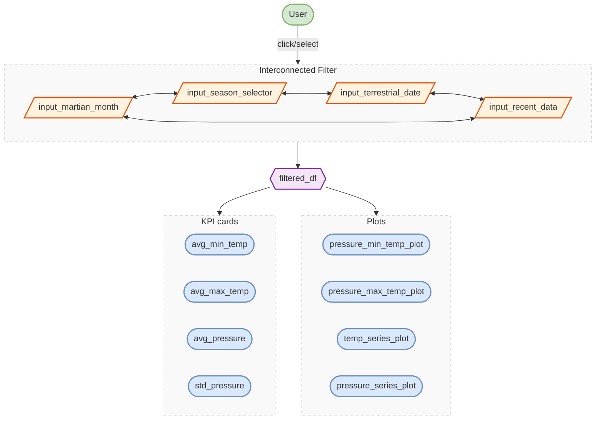
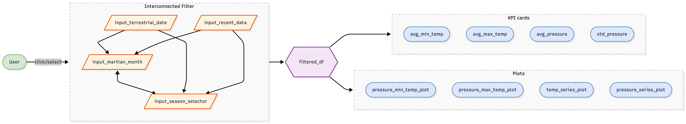

# App Specification

### Updated Job Stories

| \# | Job Story | Status | Notes |
|------------------|-------------------|------------------|------------------|
| 1 | As a rover launch planner, I want to filter temperature and air pressure measurements to be from only certain martian months or seasons, so I can determine when will be the best time to plan the launch of our new rover | ✅ Implemented 🔄 Revised | Changed from only certain Martian months to certain months or seasons to allow filtering by broader time periods |
| 2 | As the lead rover engineer, I want to understand the recent weather conditions on Mars, to identify whether the weather conditions may have contributed to the abnormal soil readings we just received. | ✅ Implemented 🔄 Revised | Changed from current to recent to accurately represent historical or recent data rather than real-time conditions |
| 3 | As a member of the rover engineering team, I want to explore the relationship between air pressure and daily temperatures to better understand the combined conditions that our new rover will need to be able to withstand | ✅ Implemented |  |
| 4 | As a climate modeller on the NASA rover team, I want to be able to see changes in temperature and air pressure over time to predict what they may be in the future. | ✅ Implemented |  |

### Component Inventory

| ID | Type | Shiny widget / renderer | Depends on | Job story |
|---------------|---------------|---------------|---------------|---------------|
| `input_martian_month` | Input | `ui.input_slider()` | — | #1 |
| `input_season_selector` | Input | `ui.input_slider()` | — | #1 |
| `input_terrestrial_date` | Input | `ui.input_slider()` | — | #4 |
| `input_recent_data` | Input | `ui.input_slider()` | — | #2 |
| `filtered_df` | Reactive calc | `@reactive.calc` | `input_martian_month`, `input_season_selector`, `input_terrestrial_date`, `input_recent_data` | #1, #2, #3, #4 |
| `avg_min_temp` | Output | `@render.text` | `filtered_df` | #1, #2 |
| `avg_max_temp` | Output | `@render.text` | `filtered_df` | #1, #2 |
| `avg_pressure` | Output | `@render.text` | `filtered_df` | #1, #2 |
| `std_pressure` | Output | `@render.text` | `filtered_df` | #1, #2 |
| `pressure_min_temp_plot` | Output | `@render.plot` | `filtered_df` | #3 |
| `pressure_max_temp_plot` | Output | `@render.plot` | `filtered_df` | #3 |
| `temp_series_plot` | Output | `@render.plot` | `filtered_df` | #4 |
| `pressure_series_plot` | Output | `@render.plot` | `filtered_df` | #4 |

### Reactivity Diagram

```` markdown

````



### Calculation Details

Main Data Filter

-   Inputs:
    -   Martian Month
    -   Season Selector
    -   Terrestrial Date
    -   Recent Data
-   Transformation:
    -   Filters all measurement data based on the selected inputs (e.g., Martian Month, Season, Terrestiral Date, or Recent Data Range)
    -   Calculates the averages and standard deviation for relevant measurements (e.g. AVG Min Temp (C), AVG Max Temp (C), AVG Pressure (Pa), or STD Pressure (Pa))
    -   Ensures that all filter options only show values valid given the other active filters (e.g., if a season is selected, the month filter only shows months within that season).
-   Outputs:
    -   Four KPI cards (AVG Min Temp (C), AVG Max Temp (C), AVG Pressure (Pa), STD Pressure (Pa))
    -   Four plots (Air Pressure with Minimum Temperature, Air Pressure with Maximum Temperature, Daily Average Temperatures, Daily Average Air Pressure)
