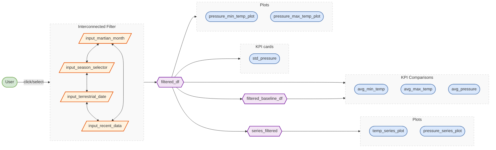
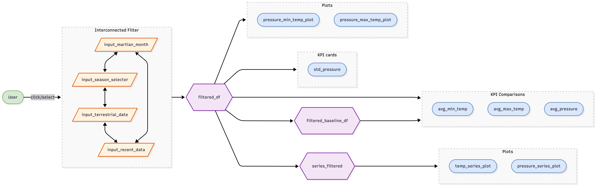

# App Specification

### Updated Job Stories

| \# | Job Story | Status | Notes |
|------------------|-------------------|------------------|------------------|
| 1 | As a rover launch planner, I want to filter temperature and air pressure measurements to be from only certain martian months or seasons, so I can determine when will be the best time to plan the launch of our new rover | ✅ Implemented 🔄 Revised | Changed from only certain Martian months to certain months or seasons to allow filtering by broader time periods |
| 2 | As the lead rover engineer, I want to understand the recent weather conditions on Mars, to identify whether the weather conditions may have contributed to the abnormal soil readings we just received. | ✅ Implemented 🔄 Revised | Changed from current to recent to accurately represent historical or recent data rather than real-time conditions |
| 3 | As a member of the rover engineering team, I want to explore the relationship between air pressure and daily temperatures to better understand the combined conditions that our new rover will need to be able to withstand | ✅ Implemented |  |
| 4 | As a climate modeller on the NASA rover team, I want to be able to see changes in temperature and air pressure over time to predict what they may be in the future. | ✅ Implemented |  |

### Component Inventory

| ID | Type | Shiny widget / renderer | Depends on | Job story |
|---------------|---------------|---------------|---------------|---------------|
| `input_martian_month` | Input | `ui.input_slider()` | — | #1 |
| `input_season_selector` | Input | `ui.input_slider()` | — | #1 |
| `input_terrestrial_date` | Input | `ui.input_slider()` | — | #4 |
| `input_recent_data` | Input | `ui.input_slider()` | — | #2 |
| `filtered_df` | Reactive calc | `@reactive.calc` | `input_martian_month`, `input_season_selector`, `input_terrestrial_date`, `input_recent_data` | #1, #2, #3, #4 |
| `filtered_baseline_df` | Reactive calc | `@reactive.calc` | `filtered_df` | #2 |
| `series_filtered` | Reactive calc | `@reactive.calc` | `filtered_df` | #4 |
| `ai_filtered_df` | Reactive calc | `@reactive.calc` | `sql_val` | #4 |
| `avg_min_temp` | Output | `@render.ui` | `filtered_df`, `filtered_baseline_df` | #1, #2 |
| `avg_max_temp` | Output | `@render.ui` | `filtered_df`, `filtered_baseline_df` | #1, #2 |
| `avg_pressure` | Output | `@render.ui` | `filtered_df`, `filtered_baseline_df` | #1, #2 |
| `std_pressure` | Output | `@render.text` | `filtered_df` | #1, #2 |
| `pressure_min_temp_plot` | Output | `@render.plot` | `filtered_df` | #3 |
| `pressure_max_temp_plot` | Output | `@render.plot` | `filtered_df` | #3 |
| `temp_series_plot` | Output | `@render.plot` | `series_filtered` | #4 |
| `pressure_series_plot` | Output | `@render.plot` | `series_filtered` | #4 |
| `ai_pressure_min_temp_plot` | Output | `@render.plot` | `ai_filtered_df` | #3 |
| `ai_temp_series_plot` | Output | `@render.plot` | `ai_filtered_df` | #4 |
| `data_table` | Output | `@render.data_frame` | `ai_filtered_df` | #3, #4 |
| `download_view` | Output | `@render.download` | `ai_filtered_df` | #4 |
| `title` | Output | `@render.text` | `title_val` | #3, #4 |

### Reactivity Diagram

### Calculation Details

filtered_df:

-   Inputs:
    -   Martian Month
    -   Season Selector
    -   Terrestrial Date
    -   Recent Data
-   Transformation:
    -   Filters all measurement data based on the selected inputs (e.g., Martian Month, Season, Terrestiral Date, or Recent Data Range)
    -   Calculates the averages and standard deviation for relevant measurements (e.g. AVG Min Temp (C), AVG Max Temp (C), AVG Pressure (Pa), or STD Pressure (Pa))
    -   Filters default to the most recent month, with KPIs compared to a baseline of the same period last year
    -   Ensures that all filter options only show values valid given the other active filters (e.g., if a season is selected, the month filter only shows months within that season).
-   Outputs:
    -   Four KPI cards (AVG Min Temp (C), AVG Max Temp (C), AVG Pressure (Pa), STD Pressure (Pa))
    -   Air Pressure with Minimum Temperature plot
    -   Air Pressure with Maximum Temperature plot

filtered_baseline_df:

-   Inputs:
    -   filtered_df
-   Transformation:
    -   Filters all measurement data based on the selected inputs (e.g., Martian Month, Season, Terrestiral Date, or Recent Data Range)
    -   Generates the baseline dataset by filtering to the same period one year earlier
-   Outputs:
    -   Three KPI cards (AVG Min Temp (C), AVG Max Temp (C), AVG Pressure (Pa))

series_filtered:

-   Inputs:
    -   filtered_df
-   Transformation:
    -   Resamples the data to a daily frequency (`1D`), computing the mean for each day.
-   Outputs:
    -   Daily Average Temperatures plot
    -   Daily Average Air Pressure plot
    
ai_filtered_df:

-   Inputs:
    -   AI-generated query
    -   Dataset
-   Transformation:
    -   Executes the AI-generated query on the dataset
    -   Returns the query results as a filtered dataframe, ready for display, download, or plotting
-   Outputs:
    -   Dataframe view 
    -   Download dataset
    -   Daily Average Temperatures (AI Filtered) plot
    -   Air Pressure vs Minimum Temperature (AI Filtered) plot

### Complexity Enhancement

A reset button is added to the dashboard. It restores all filters to their default values, allowing users to quickly start over and avoid manually undoing changes. This makes the dashboard more user-friendly and efficient.

### Performance Updates

In Milestone 4, release v0.4.0, we switched from loading the data from a csv directly to lazy loading using DuckDB and ibis.

**RAG-Augmented AI Page**

To improve the quality and contextual accuracy of the AI assistant, a Retrieval-Augmented Generation (RAG) pipeline was implemented:

-   Added domain-specific reference documents under `rag/docs/` to serve as the knowledge base for context enrichment.
-   Created `rag/ingestion.py` to load, split documents into chunks, and persist them as a pickle file under `vector_store/`.
-   Created `rag/retriever.py` to perform BM25 keyword search over the stored chunks and return the most relevant context for a given user query.
-   Wired the RAG pipeline into `src/app.py` using a custom `shinychat` integration, replacing the default `querychat` handling to allow context injection before each LLM call.
-   Extracted LLM prompts into dedicated files under `src/prompts/` and updated the greeting message.
